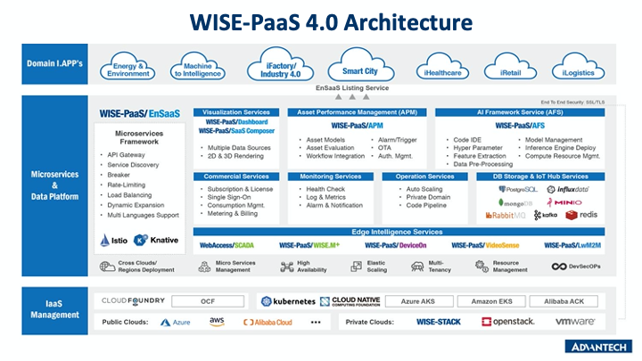
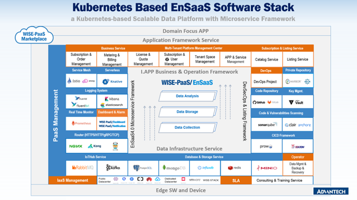

# WISE-PaaS Handbook for the Developers

## About WISE-PaaS

WISE-PaaS IIoT Cloud Platform is an integrated IoT service platform designed to lower the barrier of developing cloud-based industrial solutinos with IoT technologies. It allows the user to easily and securely connect, manage and collect massive IoT data, as well as process, analyze, and visualize data in real time through a comprehensive set of services offer by the platform. WISE-PaaS also simplifies the deployment of IoT solutions with its configuration driven and low-code experience delivered by Advantech's services purposely built for the platform, allowing the solution providers to dedicate resources to their area of expertise when implementing a solution with WISE-PaaS.

Solution implemented with WISE-PaaS can be made available as subscribable services on the Marketplace, which acts as a channel to attract business opportunities for the solution providers, and a medium for rapid deployment of cloud-based IoT solutions.

### WISE-PaaS Architecture

WISE-PaaS embodies 3 conceptual layers:
- Domain I.Apps
- Microservices and Data Platform
- IaaS Management

The core is the Microservices and Data Platform layer as depicted in the architecture diagram. It combines the services to facilitate data collection and storage, and to manage the cloud computing resources supplied by various cloud providers. The features for managing cloud resources and provide support to host cloud-based applications are offered through a service called EnSaaS.

## WISE-PaaS/EnSaaS

EnSaaS is the foundation host and build IoT solutions with WISE-PaaS. It is a cloud agnostic computing resource management service built on top of Kubernetes and provides features necessary for developers to operate a business ready IoT SaaS:
- **Microservice Framework**, including API management, service discovery, load-balancing, and more.
- **Commercial Services**, including licensing service, SSO, metering and billing, and more.
- **Monitoring Services**, such as helth check, logs, and alarms.
- **Operation Services**, including auto-scaling, private domain, and more.
- **Database, Storage, and Messaging Services**

The details of the technology stack of EnSaaS is described in the picture below:

EnSaaS is made with some of the most popular open source projects so it is easy for experienced developers who are familiar with Kubernetes to get started quickly.

## Start Building IoT Solution with WISE-PaaS

There are some important resources to help developers get started.

### Training and Certification
<https://training.wise-paas.advantech.com>

The training and certification website provides on-demand training videos for the user to learn how to use the features of WISE-PaaS. Upon registering, users will get a limited-time access to WISE-PaaS to do hands-on examples shown in the training videos.

### Marketplace
<https://wise-paas.advantech.com>

Users can register for a free trial of WISE-PaaS on the Marketplace website, and start building solutions with the available services.

### Technical Resources

[Technical Documents](https://docs.wise-paas.advantech.com)

[EnSaaS Documents for Developers](https://github.com/ensaas/document)

[GitHub for Sample Codes](https://github.com/WISE-PaaS)

[Open Issue Tracker](https://github.com/WISE-PaaS/wp-handbook/issues)

[Developer Q&A Forum](https://forum.wise-paas.advantech.com)
